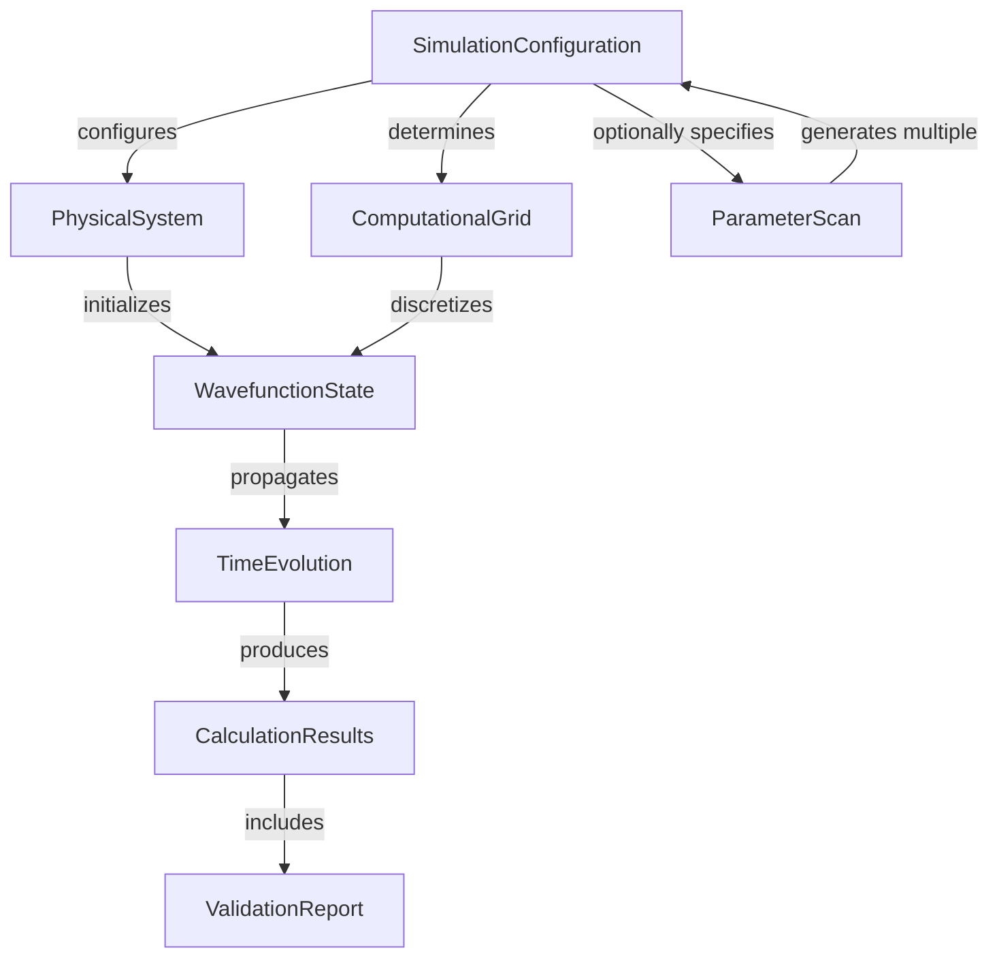

# Phase 1 Design: Data Model

**Branch**: `001-julia-api` | **Date**: 2025-01-21
**Purpose**: Define core data structures and their relationships

## Overview

This document defines the data model for the TDSE solver, extracted from functional requirements in spec.md. The model follows the 10-module architecture from constitution and supports TOML configuration input with HDF5 output.

---

## Core Entities

### 1. SimulationConfiguration

**Purpose**: Complete specification of a TDSE calculation loaded from TOML file

**Source**: FR-001, User Story 1-4, Design Decision "Parameter Input Mechanism"

**Fields**:
```julia
struct SimulationConfiguration
    # Atomic system
    atom_type::Symbol              # :hydrogen, :helium, :argon, :neon, :xenon, :custom
    custom_potential::Union{String, Function, Nothing}  # Expression or function for custom potential
    charge::Float64                # Effective nuclear charge (if custom)

    # Laser parameters
    wavelength_nm::Float64         # Wavelength in nanometers
    intensity_W_cm2::Float64       # Intensity in W/cm²
    pulse_duration_fs::Float64     # Pulse duration (FWHM) in femtoseconds
    polarization::Vector{Float64}  # [ex, ey, ez] - polarization vector

    # Calculation type
    calculation_type::Symbol       # :ionization or :hhg

    # Output configuration
    output_file::String            # HDF5 file path for results
    log_file::Union{String, Nothing}  # Optional progress log file
    verbosity::Symbol              # :minimal, :normal, :verbose

    # Optional numerical overrides (for advanced users)
    numerical_overrides::Dict{Symbol, Any}  # e.g., :nrmax => 500, :lmax => 120

    # Parameter scan (if applicable)
    scan::Union{ParameterScan, Nothing}
end
```

**Validation Rules** (FR-006):
- `wavelength_nm > 0`
- `intensity_W_cm2 > 0`
- `pulse_duration_fs > 0`
- `norm(polarization) ≈ 1.0` (normalized)
- `calculation_type ∈ [:ionization, :hhg]`
- `verbosity ∈ [:minimal, :normal, :verbose]`
- If `atom_type == :custom`, `custom_potential` must be non-nothing

**Lifecycle**:
1. Parse from TOML file via `TOML.parsefile()`
2. Validate all constraints (fail-fast at load time per clarification Q3)
3. Convert physical units (nm → a.u., W/cm² → a.u.)
4. Pass to `TDSESolver.run_tdse(config)`

---

### 2. ParameterScan

**Purpose**: Specifies parameter sweep for batch calculations

**Source**: FR-012, User Story 4, Design Decision "Parameter Scan Specification"

**Fields**:
```julia
struct ParameterScan
    parameter::Symbol              # e.g., :laser_intensity, :wavelength
    range::StepRangeLen            # Julia range object (start:step:stop)

    # For multi-dimensional scans
    parameters::Union{Vector{Symbol}, Nothing}
    ranges::Union{Vector{StepRangeLen}, Nothing}
end
```

**Validation Rules**:
- If single parameter: `parameter` and `range` non-nothing, others nothing
- If multi-parameter: `parameters` and `ranges` non-nothing, single fields nothing
- `length(parameters) == length(ranges)` for multi-parameter
- Each parameter must be valid field path (e.g., `:laser.intensity`)

**Usage**:
```julia
# Single parameter scan
scan = ParameterScan(
    parameter = :laser_intensity,
    range = range(1e14, step=1e14, stop=1e15)  # 10 points
)

# Multi-parameter scan (2D grid)
scan = ParameterScan(
    parameters = [:laser_intensity, :wavelength],
    ranges = [range(1e14, step=5e13, stop=5e14),
              range(400, step=200, stop=1200)]
)
```

---

### 3. PhysicalSystem

**Purpose**: Atom-field system including potential, ground state, and derived physical quantities

**Source**: FR-002, FR-003, FR-009, Constitution Principle III

**Fields**:
```julia
struct PhysicalSystem
    # Atomic potential
    potential::Function            # V(r) in atomic units
    potential_derivative::Function # -∂V/∂z for field interaction

    # Ground state properties
    ground_state_energy::Float64   # Ionization potential (negative, in Ha)
    ground_state_quantum_numbers::Tuple{Int, Int}  # (n, l)
    ground_state_wavefunction::Vector{ComplexF64}  # ψ_0(r) on radial grid

    # Field properties (derived from config)
    laser_frequency::Float64       # ω in a.u.
    field_amplitude::Float64       # E_0 in a.u.
    ponderomotive_energy::Float64  # U_p = E_0²/(4ω²)
    keldysh_parameter::Float64     # γ = √(2I_p / U_p)
end
```

**Derived Quantities**:
- `ponderomotive_energy`: Computed from intensity and frequency
- `keldysh_parameter`: Computed from I_p and U_p

**Validation** (FR-009):
- Ground state energy must match literature values:
  - Hydrogen: -0.5 Ha ± 1e-10
  - Helium: -0.9 Ha ± 1e-8
- Verify against Fortran blueprints (`check_ground = -0.9d0` for He)

---

### 4. ComputationalGrid

**Purpose**: Spatial and temporal discretization using GPS method

**Source**: FR-002, Constitution Principle III, Fortran blueprints

**Fields**:
```julia
struct ComputationalGrid
    # Radial grid (GPS method with algebraic mapping)
    nrmax::Int                     # Number of radial points
    rmax::Float64                  # Maximum radius (a.u.)
    L::Float64                     # Mapping parameter
    α::Float64                     # Smoothness parameter
    radial_grid::Vector{Float64}   # r_i = L(1+x_i)/(1-x_i+α)
    radial_derivative::Vector{Float64}  # dr/dx for integration
    quadrature_weights::Vector{Float64} # Gauss-Legendre weights

    # Angular grid (for 3D)
    nthmax::Int                    # Number of θ points
    nphimax::Int                   # Number of φ points
    theta_grid::Vector{Float64}    # θ ∈ [0, π]
    phi_grid::Vector{Float64}      # φ ∈ [0, 2π]
    theta_weights::Vector{Float64} # Quadrature weights for θ
    phi_weights::Vector{Float64}   # Quadrature weights for φ

    # Angular momentum cutoff
    lmax::Int                      # Maximum l value

    # Time grid
    time_step::Float64             # Δt in a.u.
    total_time::Float64            # Total propagation time
    num_steps::Int                 # Number of time steps

    # Absorbing boundary parameters
    r_absorber_start::Float64      # Start radius for absorber
    absorber_strength::Float64     # Absorption coefficient
end
```

**Automatic Determination** (FR-002):
- `nrmax`: Determined from ponderomotive energy and wavelength
- `lmax`: Determined from k₀ * rmax (classical momentum cutoff)
- `time_step`: Determined from stability criterion Δt < π/E_max
- `r_absorber_start`: Set to 0.9 * rmax

**Validation**:
- Stability: Δt ≤ π/E_max (E_max from eigenstate energies)
- Resolution: Ensure Δr ≤ π/p_max where p_max = √(2(I_p + 10U_p))
- Absorber: r_absorber_start < rmax

---

### 5. WavefunctionState

**Purpose**: Quantum state at specific time during propagation

**Source**: FR-008, Constitution Principle III, Fortran blueprints

**Fields**:
```julia
mutable struct WavefunctionState
    # Radial representation (spectral basis)
    radial_wavefunction::Array{ComplexF64, 3}  # ψ(r, m, l) - shape (nr, -lmax:lmax, 0:lmax)

    # Time information
    current_time::Float64          # Current simulation time (a.u.)
    time_step_number::Int          # Current step index

    # Diagnostic quantities
    norm::Float64                  # ⟨ψ|ψ⟩
    bound_population::Float64      # Population in bound states
    ionization_probability::Float64  # 1 - bound_population
    energy_expectation::Float64    # ⟨ψ|H|ψ⟩ (for field-free periods)
end
```

**State Updates**:
- Updated every time step during propagation
- Norm monitored for conservation (should remain ~1.0 accounting for absorber)
- Checkpointed periodically if configured

---

### 6. CalculationResults

**Purpose**: Final output including momentum distributions, HHG spectrum, validation diagnostics

**Source**: FR-004, FR-005, FR-010, FR-011, Design Decision "Result Format"

**Fields**:
```julia
struct CalculationResults
    # Momentum distributions (for ionization calculations)
    momentum_distribution_radial::Union{Vector{Float64}, Nothing}  # P(p)
    momentum_distribution_2D_xy::Union{Matrix{Float64}, Nothing}   # P(px, py)
    momentum_distribution_2D_xz::Union{Matrix{Float64}, Nothing}   # P(px, pz)
    momentum_distribution_3D::Union{Array{Float64, 3}, Nothing}    # P(px, py, pz)

    # Momentum grids
    p_grid::Vector{Float64}        # Radial momentum grid
    px_grid::Vector{Float64}       # Momentum x grid
    py_grid::Vector{Float64}       # Momentum y grid
    pz_grid::Vector{Float64}       # Momentum z grid

    # HHG spectrum (for HHG calculations)
    hhg_spectrum::Union{Vector{Float64}, Nothing}  # S(ω)
    photon_energy_grid::Union{Vector{Float64}, Nothing}  # ω in eV
    harmonic_orders::Union{Vector{Int}, Nothing}   # Identified harmonic orders
    cutoff_position::Union{Float64, Nothing}       # Cutoff photon energy (eV)

    # Validation diagnostics (FR-011)
    norm_history::Vector{Float64}  # Norm at each time step
    energy_conservation::Vector{Float64}  # Energy during field-free periods
    correlation_with_fortran::Union{Float64, Nothing}  # If benchmark available

    # Metadata
    configuration::SimulationConfiguration  # Original config
    computation_time::Float64      # Wall-clock time (seconds)
    julia_version::String          # Julia version used
    package_versions::Dict{String, String}  # Dependency versions
    timestamp::String              # ISO 8601 timestamp
end
```

**Storage Format** (HDF5):
```
helium_800nm_results.h5
├── /momentum_distributions
│   ├── P_radial [dataset]
│   ├── P_px_py [dataset]
│   ├── P_px_pz [dataset]
│   ├── px_grid [dataset]
│   └── py_grid [dataset]
├── /hhg_spectrum (if applicable)
│   ├── spectrum [dataset]
│   ├── photon_energy [dataset]
│   └── harmonic_orders [dataset]
├── /validation_diagnostics
│   ├── norm_history [dataset]
│   ├── energy_conservation [dataset]
│   └── correlation_with_fortran [attribute]
└── /metadata
    ├── wavelength_nm [attribute]
    ├── intensity_W_cm2 [attribute]
    ├── computation_time_s [attribute]
    └── timestamp [attribute]
```

**Access Pattern**:
```julia
# Load results
results = TDSESolver.load_result("helium_800nm_results.h5")

# Query specific data
P_px_py = results.momentum_distribution_2D_xy
cutoff_eV = results.cutoff_position

# Or direct HDF5 access
h5open("helium_800nm_results.h5", "r") do file
    P = read(file, "momentum_distributions/P_px_py")
    wavelength = read(attributes(file["metadata"]), "wavelength_nm")
end
```

---

### 7. ValidationReport

**Purpose**: Quality checks on calculation

**Source**: FR-011, FR-009, SC-003, SC-006, SC-009

**Fields**:
```julia
struct ValidationReport
    # Norm conservation
    norm_conservation_min::Float64  # Minimum norm during propagation
    norm_conservation_max::Float64  # Maximum norm during propagation
    norm_violation::Bool            # True if |norm - 1.0| > threshold

    # Energy conservation (field-free periods)
    energy_conservation_error::Float64  # Max ΔE/E during field-free
    energy_violation::Bool          # True if error > threshold

    # Symmetry checks (if applicable)
    cylindrical_symmetry_error::Union{Float64, Nothing}  # For linearly polarized
    symmetry_violation::Bool

    # Benchmark comparison (if available)
    fortran_correlation::Union{Float64, Nothing}  # Correlation with Fortran
    benchmark_passed::Bool          # True if correlation > 0.999

    # HHG validation (if applicable)
    hhg_cutoff_theory::Union{Float64, Nothing}  # I_p + 3.17U_p (eV)
    hhg_cutoff_actual::Union{Float64, Nothing}  # Measured cutoff (eV)
    hhg_cutoff_error_percent::Union{Float64, Nothing}  # |actual - theory|/theory
    hhg_odd_harmonics::Union{Bool, Nothing}     # True if only odd harmonics present

    # Overall assessment
    passed_validation::Bool         # True if all checks passed
    warnings::Vector{String}        # List of warning messages
end
```

**Validation Thresholds** (from spec):
- Norm conservation: `0.9999 < norm < 1.0001` (accounting for absorber)
- Energy conservation: `ΔE/E < 1e-6` (field-free periods)
- Fortran correlation: `> 0.999` (SC-003)
- HHG cutoff error: `< 5%` (SC-009)

**Report Generation**:
```julia
# Automatic validation during run
report = validate_calculation(results)

if !report.passed_validation
    @warn "Validation failed" report.warnings
    if report.norm_violation
        @error "Norm conservation violated"
    end
end
```

---

## Entity Relationships



### Dependency Graph (Modules)

```
ConfigParser → ValidationReport
     ↓              ↓
PhysicalSystem → Orchestrator → CalculationResults
     ↓              ↓
ComputationalGrid → WavefunctionState
```

**Acyclic**: No circular dependencies (Constitution Principle II)

---

## State Transitions

### WavefunctionState Lifecycle

```
1. [Initialization] → Load ground state from eigenstate calculation
   - radial_wavefunction[:, 0, 0] = ground_state_ψ
   - norm = 1.0
   - ionization_probability = 0.0

2. [Propagation Loop] → Repeat for each time step:
   a. Apply S-matrix (field-free evolution Δt/2)
   b. Transform to angular representation
   c. Apply field interaction (exp(-i V·E Δt))
   d. Transform back to radial representation
   e. Apply S-matrix (field-free evolution Δt/2)
   f. Apply absorbing boundary
   g. Update diagnostics (norm, populations)
   h. Checkpoint if configured

3. [Finalization] → Project onto momentum eigenstates
   - Compute momentum distributions P(p)
   - Or compute HHG spectrum S(ω)

4. [Validation] → Generate ValidationReport
```

### CalculationResults Lifecycle

```
1. [Creation] → After propagation completes
   - Populate momentum distributions or HHG spectrum
   - Collect validation diagnostics
   - Record metadata

2. [Storage] → Write to HDF5 file
   - Organize into groups (/momentum_distributions, /validation_diagnostics, /metadata)
   - Add attributes (wavelength, intensity, timestamp)
   - Compress datasets (gzip)

3. [Retrieval] → Load from HDF5 file
   - Reconstruct CalculationResults struct
   - Lazy-load large arrays (momentum distributions)
```

---

## Data Volume Estimates

### Typical Calculation (Helium, 800 nm, 10 optical cycles)

**ComputationalGrid**:
- Radial: 400 points × 8 bytes = 3.2 KB
- Angular: 180 θ × 60 φ × 8 bytes = 86 KB
- Total grid data: ~100 KB

**WavefunctionState** (single time step):
- Shape: (400, 321, 160) = 20.5M elements (m ∈ [-160, 160], l ∈ [0, 159])
- Size: 20.5M × 16 bytes (ComplexF64) = 328 MB

**Time Evolution**:
- 10 optical cycles at 800 nm: T = 10 × (800 nm / c) = 27 fs
- Time step Δt = 0.1 a.u. = 2.42 as
- Number of steps: 27 fs / 2.42 as ≈ 11,000 steps
- Storage (if checkpointing every 1000 steps): 328 MB × 11 = 3.6 GB

**CalculationResults**:
- Momentum distribution 2D (1000 × 1000): 8 MB
- Momentum distribution 3D (100 × 100 × 100): 8 MB
- HHG spectrum (10000 points): 80 KB
- Validation diagnostics: ~1 MB
- Total output: ~20 MB (compressed to ~5 MB with HDF5 gzip)

### Parameter Scan (10 intensity points)

- 10 individual calculations × 20 MB = 200 MB total
- Aggregated results in single HDF5 file with scan dimension

---

## Implementation Notes

### Type Stability

All structs defined with concrete types (Float64, ComplexF64) for performance. Avoid `Any` except where necessary (e.g., `Union{T, Nothing}` for optional fields).

### Memory Layout

Arrays use column-major order (default in Julia, same as Fortran) for efficient BLAS operations and cache locality.

### Immutability

Most entities are immutable (`struct`) except `WavefunctionState` (mutable during propagation). This prevents accidental modification and enables compiler optimizations.

### Validation Timing

Per clarification Q3, all validation happens at configuration load time (`load_config`), not during calculation. This implements fail-fast principle.

---

## Next Steps

1. **Generate API contracts** (`contracts/api-reference.md`) defining function signatures for each module
2. **Generate quickstart guide** (`quickstart.md`) showing minimal example usage
3. **Update agent context** with technology stack (Julia 1.10+, HDF5.jl, FFTW.jl, etc.)
4. **Re-validate Constitution Check** after design (should still pass)
